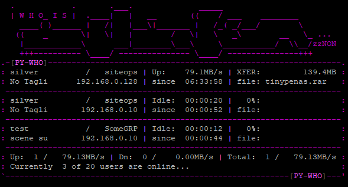

# PY-WHO!?

## /pai-hu/

Pzs-ng's sitewho ported to Python, uses SHM and glftpd's 'ONLINE' C struct and can be used as drop-in replacement.



See [Screenshots.md](docs/Screenshots.md) for more examples

## New features

- only 1 py module dependency: sysv_ipc
- fully themable output including colors! .. and emoji💾😆
- set maxusers=-1 to auto get value from glftpd.conf
- can also be build as single binary (using pyinstaller)
- aads same features as sitewho+2 ip/geoip2
- adds spy mode, like gl_spy (test)

..also, now 200% slower!

## Usage

same args and options as pzs-ng sitewho:

``` bash
./pywho                     # show all users
./pywho <username>          # show specified user
./pywho --raw               # show all users, display in raw format
./pywho --nbw               # show total stats for all users
./pywho --raw <username>    # show username, display in raw format
```

newly added in pywho:

``` bash
./phywho --help
./phywho --version
./phywho --spy              # spy mode (if enabled)
./phywho --xxl              # wide mode (if enabled)
```

## Installation

### Requirements

- python 3.7+ and 'sysv_ipc' module, all other modules used are from python standard lib
- only latest glftpd version 2.11a is supported (other versions untested)

### Python script

Make sure you have the 'sysv_ipc' module is installed:

- `apt install python3-sysv-ipc` (or yum)

Or, use a virtual env and pip:

- `python3 -m venv venv`
- `source venv/bin/activate`
- `pip install sysv-ipc` (or, build from src: [https://github.com/osvenskan/sysv_ip](https://github.com/osvenskan/sysv_ipc))

Optionally install geoip module: install 'python3-geoip2' pkg or `pip install geoip2`)

Now `git clone` this repo and run `./pywho.py`

### Binaries

If you do not want to install python modules, there's also a single executable file available for download:

- CentOS 7 [pywho-centos-python3-x86_x64.gz](bin/pywho-centos-python3-x86_x64.tar.gz) ([shasum](bin/pywho-centos-python3-x86_x64.sha512sum))
- Debian 10/11 [pywho-debian-python3-x86_x64.gz](bin/pywho-debian-python3-x86_x64.tar.gz) ([shasum](bin/pywho-debian-python3-x86_x64.shasum))

### glftpd

Optionally add pywho as site_cmd in glftpd.conf and replace binary(WHO) in ngBot.conf

## Configuration

Configure options in 'pywho.conf'. The ones on top are standard options, same as sitewho.conf. There are options added in new sections GEOIP, THEME, SPYMODE and XXLMODE. All options are explained at the bottom. Make sure 'ipc_key' matches glftpd.

_Note that ss5, geoip, spy and xxl mode are disabled by default. To enable, edit pywho.py: `_WITH_GEOIP =  True` etc_

## Build

To build the pywho binary yourself you need PyInstaller. You probably want to setup and activate a virtual env first (see above) then `pip install sysv-ipc pyinstaller`.

Now clone this repo and run `build.sh`, or optionally add one or more of these args:

`build.sh _WITH_ALTWHO _WITH_SS5 _WITH_SPY _WITH_GEOIP _WITH_XXL`

### Issues

#### runtime

- If you get this message at runtime: `INTERNAL ERROR: cannot create temporary directory!` then make sure your tmp dir exists with `+x` and `+t` (sticky bit).

- When running chrooted from glftpd you'll need to `mkdir -m 1777 -p /glftpd/var/tmp`

- If geoip2 and spy mode are enabled you can run out of your free geoip queries (max 1000/day). IP lookups are chached in mem only and reset on every restart of pywho.

- Spy mode sucks! it doesnt work, updates slowly, ignores key presses, text gets fucked up. Well yeah, it uses simple ansi escape sequences and select() stdin instead of curses and input events etc..

#### build

- The build script will check and warn about wrong python version and missing modules.

## Pywhy and how?

Just to see if its possible, ofc.. for all you pyfuckers

The sysv_ipc module does the heavy lifting rly. Unpacked data from shm segments buffer are wrapped in a namedtuple for readability and inserted to a list called 'user' e.g. `user[x].tagline`.

In general the code could probably be improved a lot and more 'pythonic' (more like moronic) and chunks are still just directly copied and converted from C.
