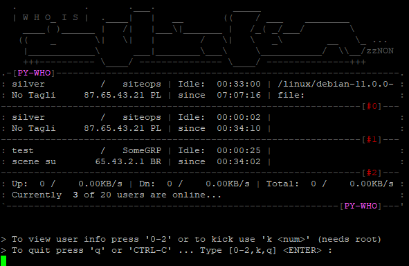
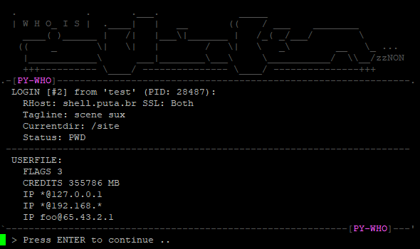

# Screen caps

## Spy mode

main screen and user info:

`./pyshow --spy`



`2 <ENTER>`



## Normal mode

 user downloading:

``` python
./pywho.py
 .            .       .___.              _____
 | W H O_ I S |  .____|   |   __       ((    / ___    ________
   ____( )______ |   /|   |___\|_______ |   /_( _/___/        \
  ((    _       \|   \|   |        /   \|   \   _\        __   \_ ...
   |____________\      ___|________\___\     \___________/  \\__/zzNON
   +++---------- \____/ --------------- \____/ ---------------+++
.-[PY-WHO]--------------------------------------------------------------.
: test            /   SomeGRP | Idle:  00:00:19 |   0%:                 :
: scene sux        1.2.3.4 DE | since  00:46:38 | file: -al             :
 -----------------------------------------------------------------------
: urmom           /   siteops | Dn:   50.0MB/s  |   3%:                 :
: No Tagli 123.123.111.222 RU | since  00:11:33 | file: debian-11.0.0-a :
 -----------------------------------------------------------------------
: Up:  0 /    0.00KB/s | Dn:  1 /      50MB/s | Total:  1 /      50MB/s :
: Currently  2 of 20 users are online...                                :
`------------------------------------------------------------[PY-WHO]---'
```

## Raw mode

``` text
./pywho.py --raw
"USER" "silver" "siteops" ""ID" 36" "No Tagline Set" "08:39:52" "" "0" "/site/linux/debian-11.0.0-amd64-DVD-1.iso" "22729" "bar@foo.host.ru" "RU" "1.2.3.4"
"USER" "silver" "siteops" ""ID" 25" "No Tagline Set" "02:06:46" "" "0" "/site" "28479" "foo.host.ru" "RU" "1.2.3.4"
"USER" "test" "SomeGRP" ""ID" 18" "scene sux" "02:06:38" "" "0" "/site" "28487" "ident@192.168.0.10" "xX" "92.68.0.10"
```
